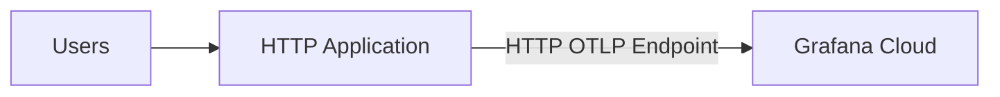

+++
title = 'Introduction to OpenTelemetry'
date = 2025-01-19T23:30:00+07:00
+++

## Background
If you're building an application, observability is essential for understanding how it performs. Popular tools like [Grafana](https://grafana.com/), [Datadog](https://www.datadoghq.com/), and [New Relic](https://newrelic.com/) each have their own way of integrating with applications. To make things simpler, OpenTelemetry was introduced as a standard for observability, and most of these tools now support it.

With OpenTelemetry, switching to a different tool doesn't mean rewriting your code. From my experience, moving to a new vendor usually takes a lot of time to refactor code, and OpenTelemetry makes the process much smoother.

## What is OpenTelemetry?
According to the official documentation:
> OpenTelemetry is:
> - An [Observability](https://opentelemetry.io/docs/concepts/observability-primer/#what-is-observability) framework and toolkit designed to create and manage telemetry data such as [traces](https://opentelemetry.io/docs/concepts/signals/traces/), [metrics](https://opentelemetry.io/docs/concepts/signals/metrics/), and [logs](https://opentelemetry.io/docs/concepts/signals/logs/).
> - Vendor- and tool-agnostic, meaning that it can be used with a broad variety of Observability backends, including open source tools like [Jaeger](https://www.jaegertracing.io/) and [Prometheus](https://prometheus.io/), as well as commercial offerings.
> - Not an observability backend like Jaeger, Prometheus, or other commercial vendors.
> - Focused on the generation, collection, management, and export of telemetry. A major goal of OpenTelemetry is that you can easily instrument your applications or systems, ***no matter their language, infrastructure, or runtime environment***. The storage and visualization of telemetry is intentionally left to other tools.

In this post, we focus on setting up and testing OpenTelemetry metrics to monitor our web application.
## Jump to Action
### What Do You Need to Prepare?
- Your favorite IDE. For example, you can use [VS Code](https://code.visualstudio.com/docs/languages/go) or [Goland](https://www.jetbrains.com/go/).
- Grafana Cloud account. You can create it [here](https://grafana.com/auth/sign-up/create-user).

### What Can You Expect by the End of This Post?
- Push metrics from the HTTP handler to Grafana Cloud.
- Create a dashboard in Grafana Cloud to monitor latency, total traffic, and success rate.

You can find the code for this implementation in [this repository](https://github.com/mfrazi/sample-code/tree/main/go/opentelemetry-grafana-cloud)

### Architecture
This is the basic architecture that we will use.

1. In our application, we will initialize a function to push metrics using the OpenTelemetry Protocol (OTLP).
2. Each HTTP request will send metrics as a histogram containing latency data to Grafana Cloud via HTTP OTLP.
   ***This is not recommended for production environments.***. For production implementation, you can check [this post](https://grafana.com/docs/grafana-cloud/send-data/otlp/send-data-otlp/#recommended-production-architecture).

### 1. Getting Auth Token and OTPL endpoint
1. [Sign In](https://grafana.com/auth/sign-in/) to the **Grafana Cloud Portal**.
2. From your organization **Overview**, select or click **your stack name** to open a Grafana Cloud stack    
3. With a stack selected, click **Configure** from the **OpenTelemetry** tile. 
4. Follow the instructions to generate an authentication token.
5. We will use this `OTEL_EXPORTER_OTLP_ENDPOINT` and this `OTEL_EXPORTER_OTLP_HEADERS` for our use case. We directly use it in our code instead of environment variable.   

### 2. Create Simple HTTP Server
We will create a simple HTTP server with a single handler to divide two numbers.
```go
package main

import (
	"fmt"
	"math/rand"
	"net/http"
	"strconv"
	"time"
)

func handleDivide(w http.ResponseWriter, r *http.Request) {
    a, b, err := parseQueryParams(r)
    if err != nil {
       http.Error(w, err.Error(), http.StatusBadRequest)
       return
    }
    
    if b == 0 {
       http.Error(w, "Cannot divide by zero", http.StatusBadRequest)
       return
    }
    
    result := float64(a) / float64(b)
    _, _ = fmt.Fprintf(w, "Division of %d by %d is %.2f", a, b, result)
}

func parseQueryParams(r *http.Request) (int, int, error) {  
    query := r.URL.Query()  
    aStr := query.Get("a")  
    bStr := query.Get("b")  
    
    if aStr == "" || bStr == "" {  
       return 0, 0, fmt.Errorf("missing query parameters 'a' or 'b'")  
    }  
    
    a, err := strconv.Atoi(aStr)  
    if err != nil {  
       return 0, 0, fmt.Errorf("invalid value for 'a': %s", aStr)  
    }  
    
    b, err := strconv.Atoi(bStr)  
    if err != nil {  
       return 0, 0, fmt.Errorf("invalid value for 'b': %s", bStr)  
    }  
    
    return a, b, nil  
}
```
<div style="text-align: center;">http.go</div>

```go
package main

import (
	"context"
	"fmt"
	"log"
	"net/http"
)

func main() {  
    http.HandleFunc("/divide", handleDivide)  
  
    port := ":8080"  
    fmt.Printf("Server is running on http://localhost%s\n", port)  
    if err := http.ListenAndServe(port, nil); err != nil {  
       log.Fatalf("Error starting server: %s", err)  
    }  
}
```
<div style="text-align: center;">main.go</div>

You can run the program above and access it, for example:
> `http://localhost:8080/divide?a=6&b=12`

and it will return:
> `Division of 6 by 12 is 0.50`

### 3. Create Module to Initialize OTLP Provider
The OTLP library provides both HTTP and gRPC options to push data directly to an OTLP endpoint. In this use case, we are using HTTP.
``` go
package main

import (
	"context"
	"log"
	"time"
	
	"go.opentelemetry.io/otel"
	"go.opentelemetry.io/otel/attribute"
	"go.opentelemetry.io/otel/exporters/otlp/otlpmetric/otlpmetrichttp"
	"go.opentelemetry.io/otel/metric"
	sdkmetric "go.opentelemetry.io/otel/sdk/metric"
	"go.opentelemetry.io/otel/sdk/resource"
	"go.opentelemetry.io/otel/semconv/v1.12.0"
)

const (
	grafanaCloudOTLPHTTPEndpoint = "" // Replace with OTEL_EXPORTER_OTLP_ENDPOINT
	grafanaAuthorization         = "" // Replace with OTEL_EXPORTER_OTLP_HEADERS - Authorization (Something like Basic xkjfasdi...)
)

func InitOTLPMetricsExporter(ctx context.Context) (*sdkmetric.MeterProvider, error) {
	httpOpts := []otlpmetrichttp.Option{
		otlpmetrichttp.WithEndpointURL(grafanaCloudOTLPHTTPEndpoint),
		otlpmetrichttp.WithHeaders(map[string]string{
			"Authorization": grafanaAuthorization,
		}),
	}
	exporter, err := otlpmetrichttp.New(ctx, httpOpts...)
	if err != nil {
		return nil, err
	}
	
	res, err := resource.New(ctx,
		resource.WithAttributes(
			semconv.ServiceNameKey.String("application"),
			semconv.ServiceVersionKey.String("1.0.0"),
		),
	)
	if err != nil {
		return nil, err
	}

	provider := sdkmetric.NewMeterProvider(
		sdkmetric.WithReader(sdkmetric.NewPeriodicReader(exporter, sdkmetric.WithInterval(5*time.Second))),
		sdkmetric.WithResource(res),
	)
	
	otel.SetMeterProvider(provider)
	
	return provider, nil
}

func pushHistogram(ctx context.Context, latency int64, tags map[string]string) {
	meter := otel.Meter("http")
	histogram, err := meter.Int64Histogram("http_handler")
	if err != nil {
		log.Printf("Failed to create histogram: %v", err)
		return
	}
	
	var labels []attribute.KeyValue
	for key, value := range tags {
		labels = append(labels, attribute.String(key, value))
	}

	histogram.Record(ctx, latency, metric.WithAttributes(labels...))
}
```
<div style="text-align: center;">otel.go</div>

- **`InitOTLPMetricsExporter`**: Initializes an OTLP metrics exporter, sets up a `MeterProvider` with periodic metric export to Grafana Cloud, and configures the resource attributes for the service.
- **`pushHistogram`**: Records latency data in a histogram with optional labels.

And then we update our *main* function to initialize OTLP provider.
```go
package main

import (
	"context"
	"fmt"
	"log"
	"net/http"
)

func main() {
	ctx := context.Background()

	// Init opentelemetry
	provider, err := InitOTLPMetricsExporter(ctx)
	if err != nil {
		log.Fatalf("Failed to initialize OTLP exporter: %v", err)
	}

	defer func() {
		if err := provider.Shutdown(ctx); err != nil {
			log.Printf("Failed to shut down MeterProvider: %v", err)
		}
	}()

	// HTTP Server
	http.HandleFunc("/divide", handleDivide)

	port := ":8080"
	fmt.Printf("Server is running on http://localhost%s\n", port)
	if err := http.ListenAndServe(port, nil); err != nil {
		log.Fatalf("Error starting server: %s", err)
	}
}
```
<div style="text-align: center;">main.go</div>

### 4. Push Histogram Metric in HTTP Handler
After that, we need to manually push the latency metric in the handler. However, this is not the best practice, as defining it in every function can be repetitive. For a better implementation, you can use middleware or a wrapper based on the HTTP library you're using.
```go
func handleDivide(w http.ResponseWriter, r *http.Request) {
	start := time.Now()
	tags := map[string]string{}
	
	// add dummy process to make sure we can get latency more than 1 millisecond
	time.Sleep(time.Duration(rand.Intn(1000)+10) * time.Millisecond)
	
	defer func() {
		pushHistogram(r.Context(), time.Since(start).Milliseconds(), tags)
	}()
	
	a, b, err := parseQueryParams(r)
	if err != nil {
		tags["error"] = err.Error()
		tags["status"] = "error"
		http.Error(w, err.Error(), http.StatusBadRequest)
		return
	}
	
	if b == 0 {
		tags["error"] = "division by zero"
		tags["status"] = "error"
		http.Error(w, "Cannot divide by zero", http.StatusBadRequest)
		return
	}
	
	result := float64(a) / float64(b)
	_, _ = fmt.Fprintf(w, "Division of %d by %d is %.2f", a, b, result)
	
	tags["status"] = "success"
}
```

## 5. Create Test Function
We can use Go's testing functions to create tests that will populate data in Grafana Cloud. You can adjust this function based on you needs.
***Make sure to run the application before executing the test.***
``` go
func TestPopulateMetricHistogram(t *testing.T) {
	url := "http://localhost:8080/divide?a=%d&b=%d"
	minNum, maxNum := -5, 5
	maxRunningTime := time.Duration(10)

	start := time.Now()
	for time.Since(start) < maxRunningTime*time.Minute {
		a := rand.Intn(maxNum-minNum+1) + minNum
		b := rand.Intn(maxNum-minNum+1) + minNum
		finalURL := fmt.Sprintf(url, a, b)

		resp, err := http.Get(finalURL)
		if err == nil {
			_ = resp.Body.Close()
		}

		// Wait for a random interval between 1 and 5 seconds
		time.Sleep(time.Duration(rand.Intn(5)+1) * time.Second)
	}
}
```
<div style="text-align: center;">test_test.go</div>

### 6. View Metrics in Grafana Cloud
After running the test above to populate the data, you can check it on your Grafana dashboard (`https://<stack_name>.grafana.net/explore/metrics`). If the metrics were successfully pushed, you should see something like the image below. Note that it may take some time for the data to fully appear on the dashboard.


### 7. Create Simple Dashboard
#### Latency
The first use case is to monitor how long a handler is running. Using these two queries, we can determine the *P95* and *P50* (median) latency across the timeseries.
```promql
histogram_quantile(0.95, sum by(le) (rate(http_handler_bucket[$__rate_interval])))
histogram_quantile(0.5, sum by(le) (rate(http_handler_bucket[$__rate_interval])))
```


#### Total Traffic
The next use case is to check the total traffic coming to our server. Using this query, we can view traffic for each label. You can aggregate all traffic using `sum` function.
```promql
increase(http_handler_count[$__rate_interval])
```


#### Success Rate
The last use case in this post is using the metrics to calculate the success rate of our HTTP handler. To calculate the success rate, we will divide the number of successful requests by the total number of requests.
```promql
sum(increase(http_handler_count[$__rate_interval]))
sum(increase(http_handler_count{status="success"}[$__rate_interval]))

Expression: $B/$A*100
```


After that, you can save all your changes, and you should see something like this:


## Conclusion
The example above shows how OpenTelemetry works at a basic level. While it's a good starting point, there are more robust solutions for production environments, like using a collector to send your data to the vendor of your choice.

Right now, OpenTelemetry helps make it easier to switch between observability services, but you'll still need to manually update dashboards and monitoring setups when you change vendors. OpenTelemetry is still "quite" in its early stages, and the documentation and examples are a bit rough, so finding solutions to issues can be tough. If you're just starting to build an application and experimenting with observability, OpenTelemetry is definitely worth trying. However, if you're working with a large system and planning to migrate to OpenTelemetry, it requires a considerable amount of effort due to the changes needed in both your code and infrastructure.

That said, OpenTelemetry has huge potential, and it's likely to become a standard across observability tools, so it's a good idea to get familiar with it now while it's evolving.

## References
- https://opentelemetry.io/docs/what-is-opentelemetry/
- https://opentelemetry.io/docs/languages/go/getting-started/
- https://grafana.com/docs/grafana-cloud/send-data/otlp/send-data-otlp/#manual-opentelemetry-setup-for-advanced-users
- https://grafana.com/docs/grafana/latest/explore/simplified-exploration/metrics/
